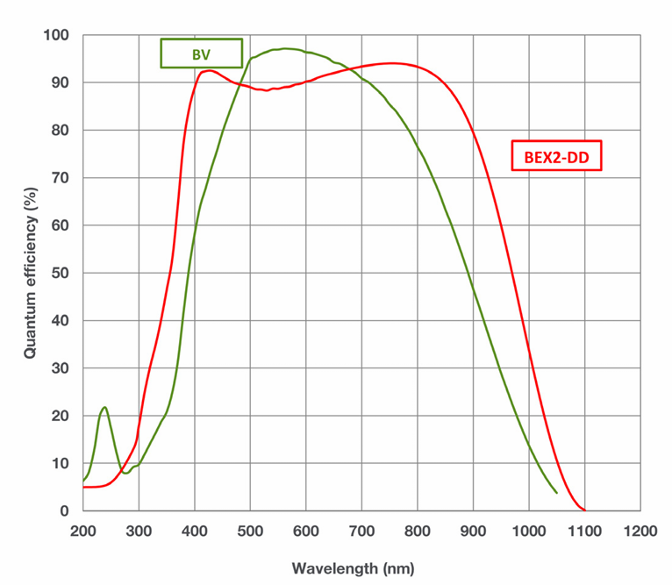

# Tsinghua-Nanshan Optical Telescope(TNOT)仪器参数简介

TNOT采用R-C望远镜，望远镜口径80 cm。测光终端搭载Andor DZ936N-BV相机。配备B、V、u、g、r、i、滤光片

## 参数CCD
详情请见：[相机产品手册PDF](./andor-ikon-l-936-specifications.pdf)
<!-- 将产品手册中的主要参数列出来 -->

### 量子效率曲线

量子效率转化成转化成ascii文件
文件路径：

## 滤光片
各个波段滤光片响应曲线ascii文件:

[SDSS-g](./Sloan-g-27056.txt)  
[SDSS-r](./Sloan-r-27056.txt)  
[SDSS-i](./Sloan-i-27056.txt)  
[SDSS-u](./Sloan-u-27056.txt)  
[Bessel-B](./Chroma-Bessell-B.txt)
[Bessel-V](./Chroma-Bessell-V.txt)
https://www.chroma.com/products/sets/27103-bessell-ubvri/

<!-- 不同波段都画出来，画到一张图中，并给出标准UBVRI和SDSS ugriz的响应曲线的对比（透明） -->

## 值班流程
详见：[TNOT 观测操作手册](/Observation/TNOT/README.md)

