# TNOT 观测操作手册

## 1. 观测前准备

### 1.1 远程连接

打开远程控制软件“向日葵”，选择对应的观测电脑。登录信息暂按以下格式填写，实际内容从内部密码管理渠道获取：

- 识别码：799793344
- 验证码：nsqh800

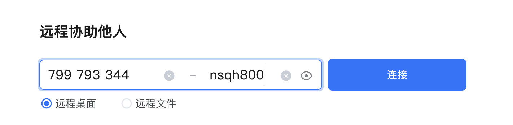

连接上后如需登录：

- 账户：admin
- 密码：nsqh.800

登录后先确认桌面、网络和远程控制响应正常，再进行天气和设备检查。若远程画面卡顿或控制延迟明显，不要直接打开圆顶或镜盖。

### 1.2 天气确认

天气确认必须覆盖实时观测环境和观测时段预报。出现降雨、雷暴、云量快速恶化或无法确认的情况时，暂停开顶和开镜盖动作，如无法独自确认，可在群里反馈。

#### 1.2.1 登录南山观测环境监测系统

打开南山观测环境监测系统（119.78.162.37），查看：

1. 实时云量监测；

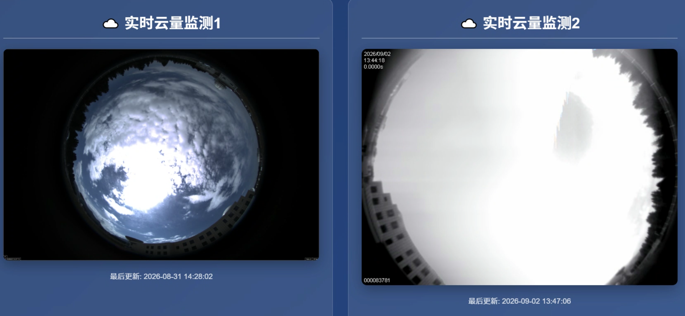

图中有无云差异明显，但需注意图像更新时间

2. 天气预报；
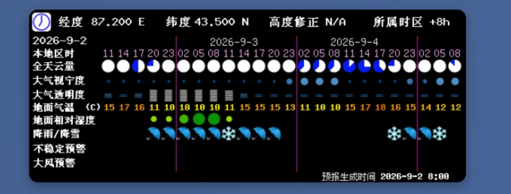

全天云量图中白色为云，蓝色为晴，降雨/降雪标注较为直接

#### 1.2.2 Windy 云图

打开 Windy( www.windy.com )，定位到“乌鲁木齐市乌鲁木齐县甘沟乡”，分别查看“雨、雷暴”和“云”图层。沿计划观测时段拖动时间轴，确认降雨、雷暴和云层变化趋势。

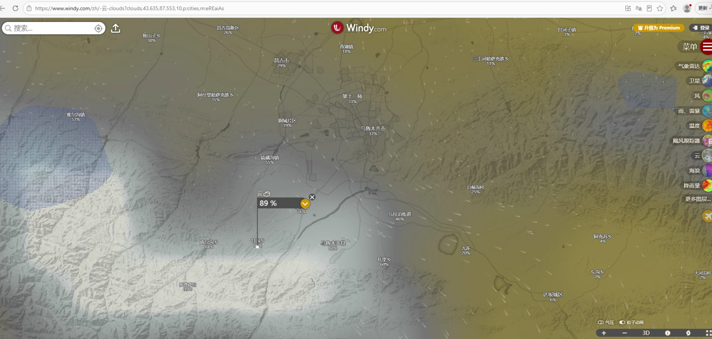

### 1.3 制定观测计划

目前根据王老师在群里发的当天观测计划制作TNOT电脑上ACP软件可读的版本

### 1.4 新建 Flat/Bias 文件夹

在E:\Data文件夹下创建今日数据文件夹如20260902，在文件夹内再分别创建Flat,Bias文件夹，以供后续拍平场使用
E:\Data文件夹在文件夹左侧快速访问中可方便找到

---

## 2. 开机

### 2.1 开启 CCD

使用 MaxIm DL Pro 6 连接 CCD：

1. 打开相机控制面板(Toggle Camera Control)，进入 `Setup`。
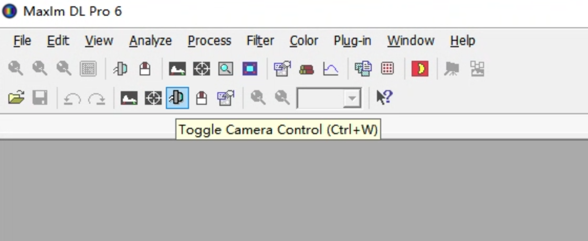

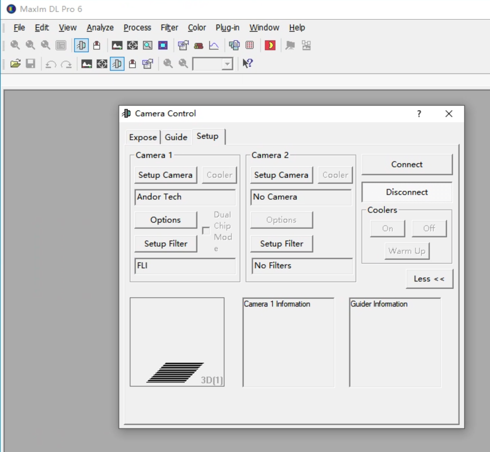

2. 主 CCD 选择 `Camera 1`，进入 `Setup camera`。
3. 在高级选项'Advanced...'中点击 `Discover`，会自动选择 `DZ936_BV`。
4. 更改 `HS speed = 1`、`Pre-amp Gain = 2`
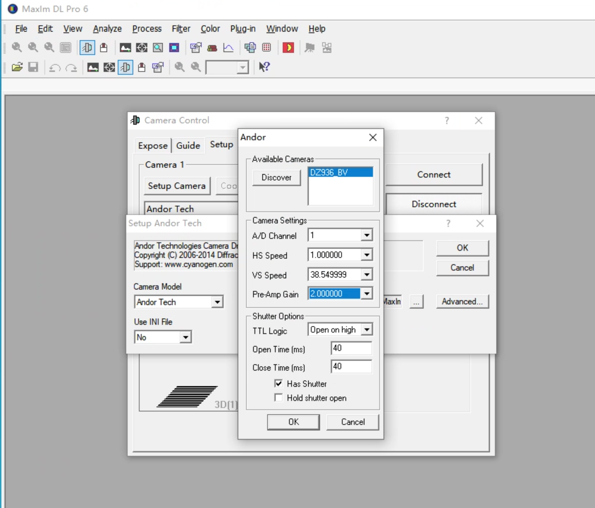
5. 点击两次 `OK` 保存设置，再点击 `Connect`连接相机。
6. 打开 `Setup-Cooler`，确认目标温度为`-70 °C`后点击 `Coolers-On`开启CCD制冷。
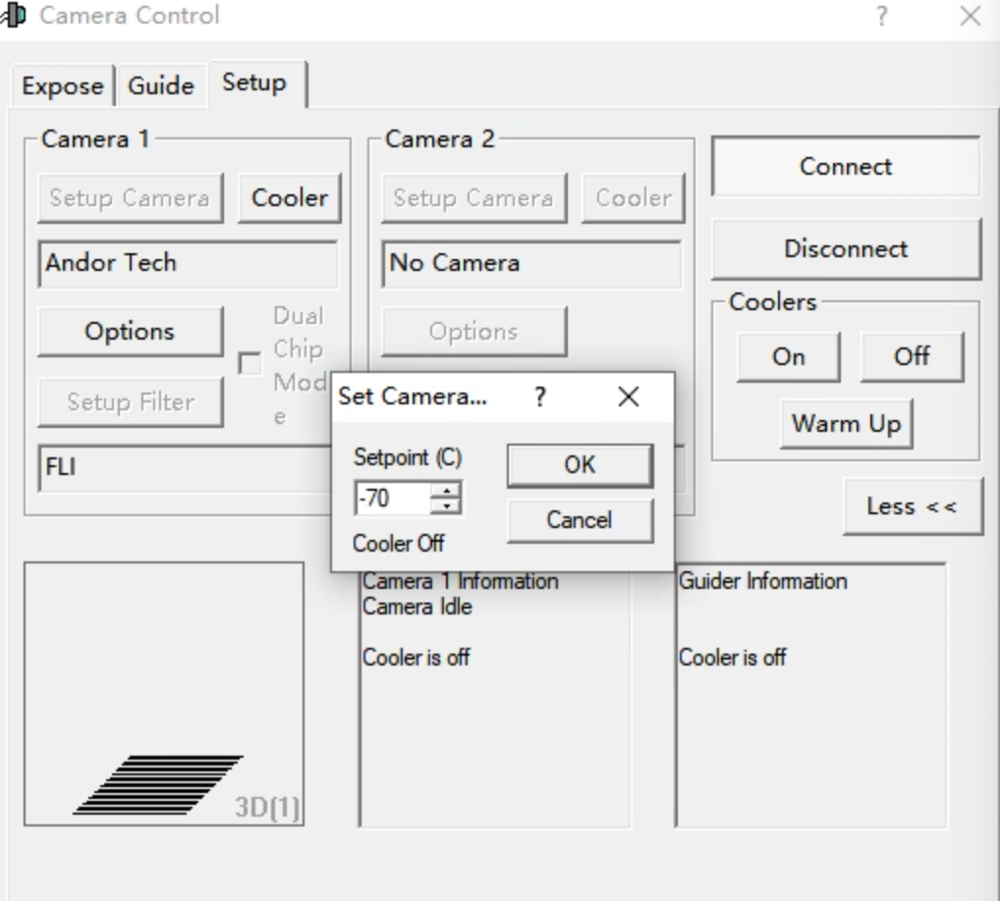

### 2.2 开启赤道仪

1. 打开 Autoslew （图标 ），点击红色按钮“Motor is OFF”使其变成绿色按钮“Motor is ON”，即已打开控制赤道仪的电机，望远镜可以调整位置。（注：此软件应为常开状态，即不要关闭此软件，缩小即可)

2. 打开 TheSkyX（图标 ），左侧点击“Start up”， 选择“Connect Telescope”连接望远镜，此时下方的 Status 变为“Connected”。随后点击旁边的“Shut down“，选择”Park“，等待进度条跑完，即可将望远镜置于前述待机位（或称Park位）。

3. 再次点击“Shut down“，选择”Unpark“，选择右边天区中高纬度且没有明显星星的天区，鼠标左键点击（此时出现红圈），随后点击左侧中部的“Slew”，等待片刻，望远镜则指向相应位置。（注意保证红圈和黄圈重合，见下图）
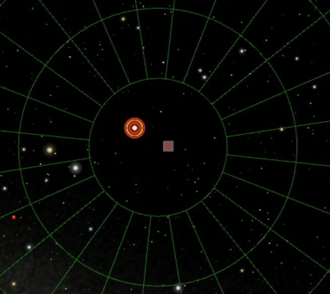

注：若电脑重启或重新打开 Autoslew 后需要校正，按现场规程在 TheSkyX 中完成连接、校正和 Park 检查，再继续后续操作。没有完成校正前，不要直接运行 ACP 自动任务。

### 2.3 开启天窗、镜盖

确认天气合适、无降雨，且监控系统中没有新的天气或设备告警后：

1. 打开全天域控制系统（图标 ），连接圆顶控制（如未登录，IP地址：192.168.1.80；连接状态中点击Connect)。

2. 点击“天窗开”，此时观察软件“iVMS-4200”即可发现站台天窗在逐步开启，天窗开启完成时，“天窗开”后面按钮变为“开到位”，见下方图片。（若位置反馈、动作声音或监控画面异常，立即停止并联系负责人。）

 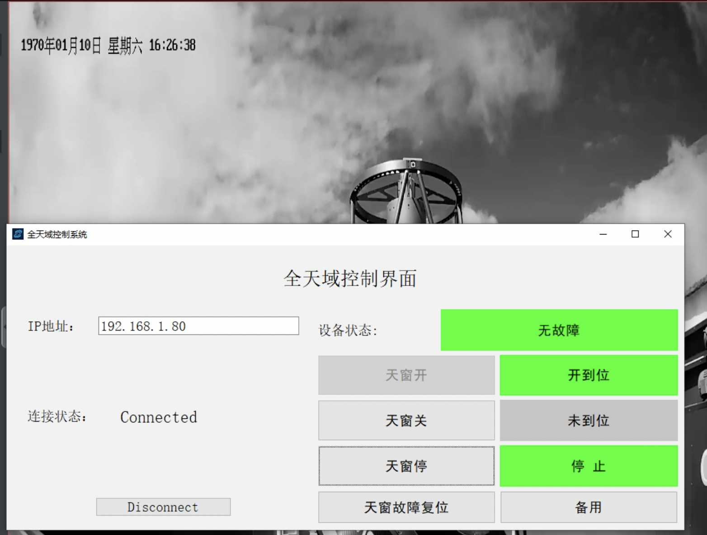

3. 圆顶稳定、天气确认无误后，再打开镜盖。打开软件“ASA Alpaca Gatew.”（ACC，软件图标），在软件内第二行六个图标中，选择第三个图标“Selects Covers”（），点击“Open”，即可开启望远镜镜盖。完成时 Cover1 和 Cover2 的状态为 “Open”，角度接近90度。

4. 调焦（后续图片质量检查后可进行此选项）

### 2.4 入夜拍平场本底

拍摄任务前，先按当晚校准方案拍摄 Flat 和 Bias，并将文件保存到 1.4 建立的目录，注意可拍摄 Flat 的时间较短，拍摄时间可参考前一天，也可参考[乌鲁木齐本地入夜时间](https://richurimo.bmcx.com/gangouxiang_y3__richurimo/)。

1. 在 MaxIm DL Pro 6 （）的“Camera Control”（）中，拍摄方式选择“Single”，同时选择合适的滤镜、曝光时间和保存路径，具体要求如下： 

   - 滤镜选择：左侧中部“Filter”下方选择波段，选择顺序为：up —> V  —> rp  —> B  —> ip —> gp，每个波段拍 5 张、指向有轻微变化（具体操作为：打开 Autoslew （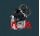）软件，点击右下角的方向键进行某个方向的轻微移动，注意需要移动完成再拍摄，即下方 Ra，De 的绝对值不超过 0.2度。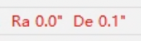

   - 曝光时间：通过调整曝光时间，保证 ADU 在 20000 到 30000，同时曝光时间需要大于 3 秒且小于 30 秒，若无法同时满足上述要求，说明拍摄时间过早或者过晚。ADU的查看方式为：点击 MaxIm DL Pro 6 上方“information”选项（见下图红框），随后鼠标在图片上滑动，在“information”窗口左上角即可查看相应区域的 ADU。

   - 保存路径：单张拍摄完成后，点击“Save”选项（见下图蓝框），选择 1.4 创建的文件夹，选择 Flat 文件夹，修改图片名称为“Flat_日期_波段_序号”，比如“Flat_20260903_up_01”，随后点击保存即可。

   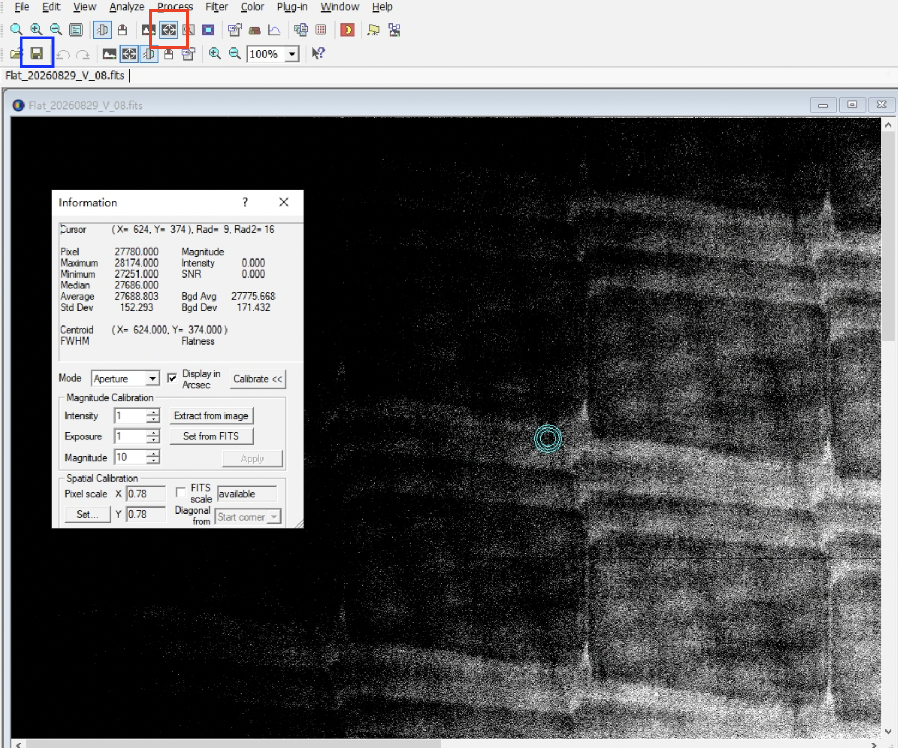

   
2. 平场拍摄完成后，拍摄Bias（本底）。在软件“Maxlm DL Pro 6”（）的“Camera Control”（）中，右侧拍摄方式改为“Autosave”，然后点击“Autosave”，修改左上角“Autosave Filename”为“Bias_日期_”，如“Bias_20260903_”，随后点击右侧中部“Option”，选择“Set Image save path...”，选择 1.4 创建的“Bias”文件夹，完成后点击“OK”即可，其他选项默认参考下方图片。再点击“start”，会自动拍8张本底照片。

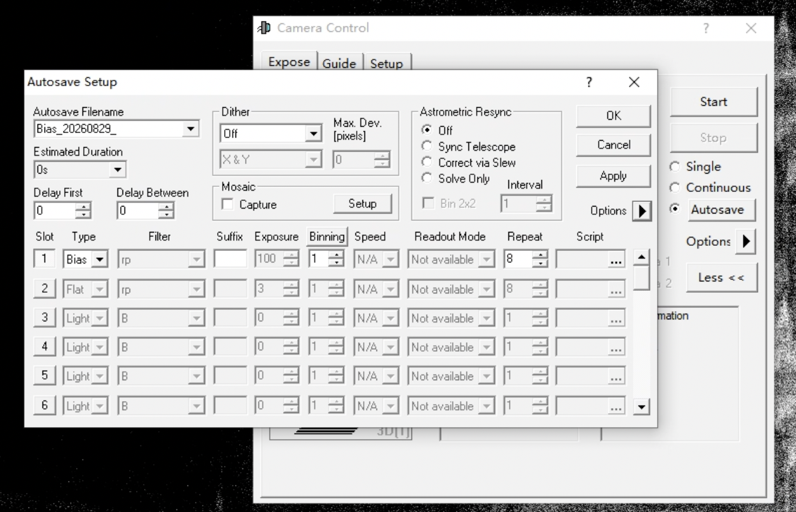

3. 打开代表性图像检查是否饱和、漏拍、文件名错位或写入错误，再开始正式观测。

---

## 3. 观测

### 3.1 上传观测列表

在 ACP 中执行自动观测任务：

1. 打开 ACP，连接望远镜和 CCD 相机：

   -连接望远镜：ACP左上角第二个选项“Telescope”中点击"Connect";连接成功后选项“Telescope”中第一行变为"Disconnect"；
   
   -连接CCD相机：ACP左上角第三个选项“Camera”中点击"Connect";连接成功后选项“Camera”中第一行变为"Disconnect"；

2. 选择脚本 `AcquireImages.js`：点击ACP右上角"Select the Script..."，在弹出的窗口中选择第一个选项“AcquireImages.js”后点击“打开”；

3. 载入已复核的 `txt` 观测列表，确认文件路径、数据目录和列表首行正确。

4. 检查望远镜状态、CCD 温度和镜盖状态，确认可以开始运动和曝光。

5. 点击 `Run`，记录任务开始时间和所用列表文件名。

   -下图为点击"Run"后的界面，在弹出的窗口中选择本日的观测列表；若观测列表有格式等类型的错误，ACP右下角的"Console output"框中会显示，需修改错误后再次上传观测列表。

这里的“上传”指将观测列表载入 ACP；正式运行前仍需在 ACP 界面复核一次参数。

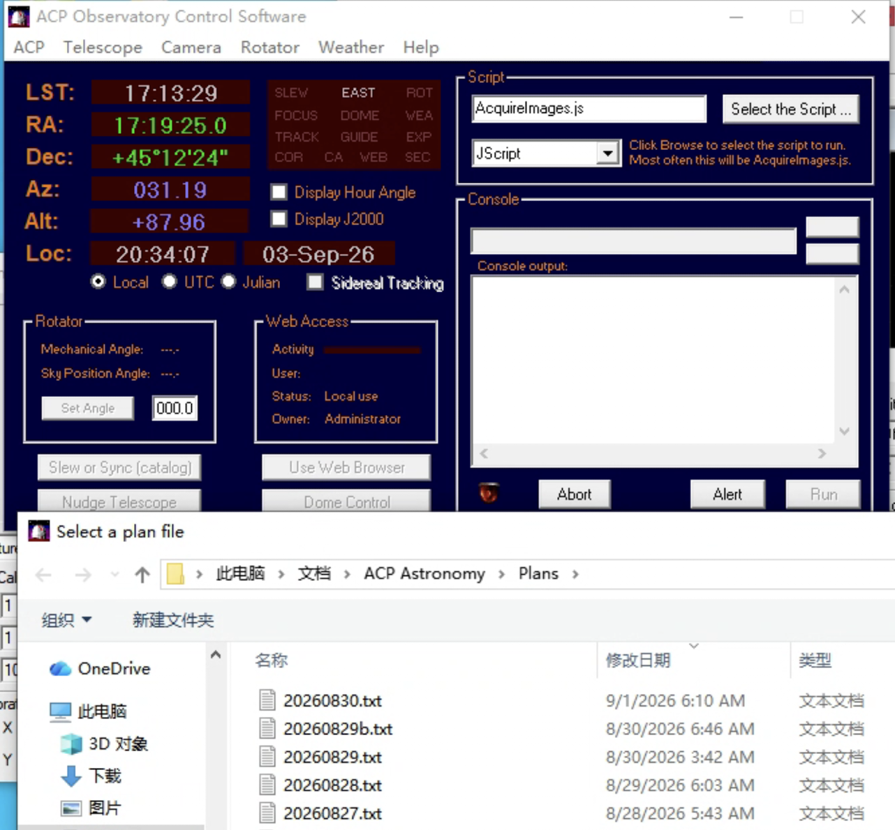

### 3.2 确认图像正常

任务开始后先检查测试曝光或第一组图像，再让任务持续运行。至少确认：

- 目标位置和指向没有明显错误；
- 滤镜、曝光时间、重复次数和文件名符合列表；
- 星象基本正常，没有明显拖线、严重失焦或异常背景；
- 图像没有大面积饱和，文件已经写入正确数据目录；
- CCD 温度、圆顶位置和赤道仪跟踪状态稳定。

-确认目标位置：在MaxIm DL Pro 6 （）中打开目标图像，在上方第四个选项"Analyze"中点击"PinPoint Astrometry..."，在中间选项框"Image Parameters"中的Approx.Center中按照观测列表中的坐标信息填入"RA"与"Dec"（具体格式见下图）。点击右下角的"Process"，若运行结果为0.78"/Pixel，可点击MaxIm DL Pro 6 （）上方图标中第二行第六个"Information"，在弹出窗口中间的"Mode"选项中选择"Astrometric"，在图像上移动贯标，"Information"框中会显示对应坐标。在图像中找到目标源，在"Mode"选项中选择"Aperture"，点击已找到的目标源位置，"Information"框中会显示FWHM，SNR等信息；FWHM需2.0左右，SNR不能过低。

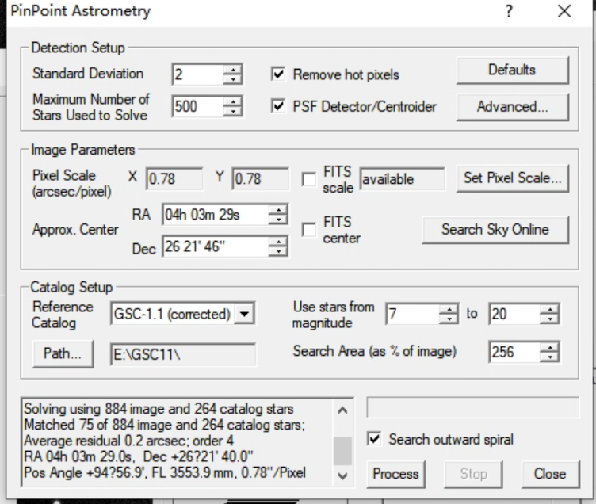
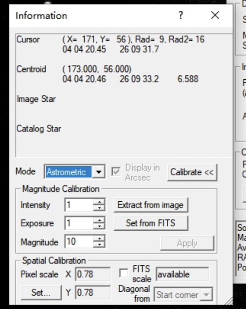

运行中定时查看天气、圆顶、镜盖、滤镜切换、CCD 温度、图像落盘和 FWHM 等状态。发现报警或图像质量明显恶化时，先暂停或在 ACP 中执行 `Abort`，记录当前目标和原因，再决定是否恢复。

---

## 4. 关机

### 4.1 出夜拍平场本底

正式观测结束或安全中止后，利用出夜时段按校准方案补拍 Flat 和 Bias。确认文件已写入 `Flat`、`Bias` 目录，并记录滤镜、曝光、张数、温度和文件范围。平场若出现亮星、饱和或明显异常，应标记为不合格并按规程重拍。

本小节与2.4小节入夜拍平场本底操作流程和要求一致，但波段拍摄顺序相反，为gp —> ip  —> B  —> rp  —> V —> up。

### 4.2 关闭镜盖、天窗

先在 ACP 中确认任务已正常结束或执行 `Abort`，等待最后一张图像写盘。确认天气和设备状态允许后，按现场联锁规程关闭镜盖，再关闭天窗（圆顶）；关闭过程中持续查看位置反馈。若发生卡顿、报警或反馈不一致，停止重复操作并联系负责人。

附件原始流程对镜盖、天窗和 Park 的先后顺序有不同写法，本小节先沿用当前章节顺序，正式版应在现场确认后固定唯一顺序。

1.在软件“ASA Alpaca Gatew.”（ACC，软件图标 ）的第二行六个图标中，选择第三个图标“Selects Covers”（），点击“Close”，即可关闭望远镜镜盖。完成时 Cover1 和 Cover2 的状态为 “Closed”，角度为00度，见下方图片。

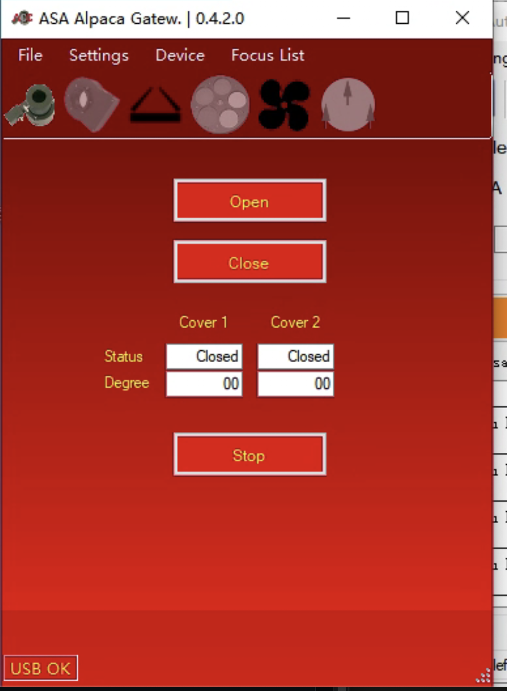

2.在全天域控制系统（图标 ）中点击“天窗关”，此时观察软件“iVMS-4200”即可发现站台天窗在逐步关闭，天窗关闭完成时，“天窗关”后面按钮变为“关到位”，见下方图片。

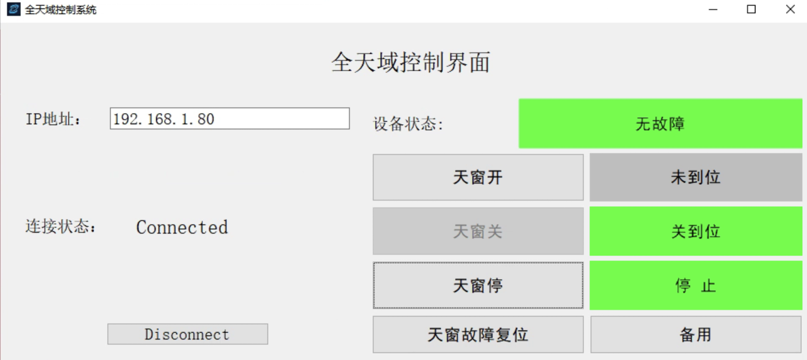

### 4.3 CCD 温度处理

本小节沿用用户提供的编号；“CCD 降温”在关机流程中可能实际指停止制冷并升温，请现场确认术语。确认后：

1. 在 MaxIm DL Pro 6 （）中停止冷却，按设备规程让 CCD 回到规定温度范围。

-在"Camera Control"中左上角三个选项中选择"Setup"，在右侧中部的"Coolers"选项框中点击"Warm Up"，见下方图片；观察下方中间框"Camera 1 Information"中"Sensor Temp"由运行时设置的-70.0度逐步上升。

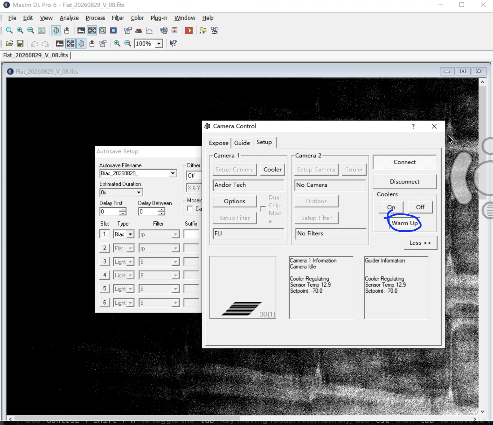

2. 等待温度变化稳定，确认没有正在进行的读出或文件写入。

-当升至0度附近，在右侧中部的"Coolers"选项框中点击"Off"，停止升温。

3. 未完成升温前不要直接关闭相机电源。

### 4.4 望远镜回 Park 位

在确认镜盖和天窗状态安全、运动范围无障碍后，通过 ACP 或 TheSkyX 执行 `Park`。等待位置反馈完成，核对望远镜确实停在 Park 位，再继续断开软件连接。

-在TheSkyX左栏上部分三个并列的选项中选择"Shut Down"，点击第三行的"Park"；停在Park位后，可见"Shut Down"选项下方的Status后以绿字显示"Parked"，见下方图片。

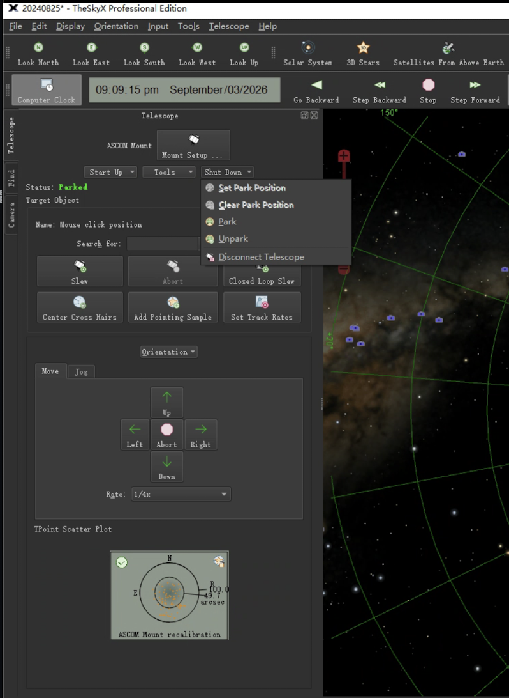

### 4.5 关闭 ACP、MaxIm DL Pro 6

确认任务停止、CCD 已完成温度处理、图像和日志均已写盘后：

1. 在 ACP 中断开望远镜和 CCD 相机连接，然后关闭 ACP。

   -断开望远镜：ACP左上角第二个选项“Telescope”中点击"Disonnect";连接成功后选项“Telescope”中第一行变为"Connect"；
   
   -断开CCD相机：ACP左上角第三个选项“Camera”中点击"Disconnect";连接成功后选项“Camera”中第一行变为"Connect"；

2. 在 MaxIm DL Pro 6 中确认冷却器关闭、相机连接断开，再关闭软件。

-相机断开连接后，在"Setup"选项下的界面下方的"Camera 1 Information"中无望远镜信息，见下方图片。

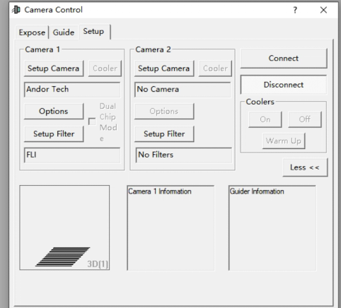

3. 不要在图像写入或 CCD 仍处于冷却状态时强制结束软件或断电。

### 4.6 关闭 Autoslew

在 TheSkyX 已断开、望远镜处于 Park 位后，按现场规程关闭或退出 Autoslew，并确认电机状态和软件状态已经记录。附件原始流程写的是将 Autoslew 置为红色（`Motor is OFF`）但不关闭软件；这与“关闭 Autoslew”的当前要求存在差异，正式版需由设备负责人确认后保留一种做法。

  -TheSkyX断开：在TheSkyX左栏上部分三个并列的选项中选择"Shut Down"，点击第五行的"Disconnect Telescope"；断开连接后，可见"Shut Down"选项下方的Status后以红字显示"Not Connected"，见下方图片。

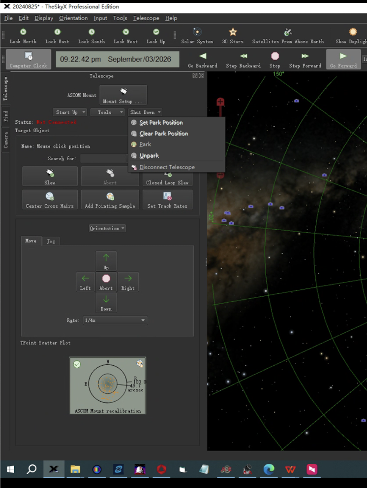

---

---

## 5. 数据传输

本节暂空，后续补充以下内容：

- 数据源目录和目标服务器/磁盘；
- 使用的传输工具和登录方式；
- 文件命名、数量、大小和校验方法；
- 传输失败时的重试、保留本地原始数据和联系人；
- 观测日志、Flat/Bias 与科学图像的交接方式。

> 图片：``
> 视频：`<video controls src="media/05-data-transfer.mp4"></video>`

---

## 6. FAQ

### 6.1 天气不稳定，还能开顶吗？

不能仅凭单个页面判断。结合南山监测系统和 Windy 的观测时段趋势判断；无法确认时保持天窗和镜盖关闭，并记录原因。

### 6.2 向日葵连不上怎么办？

先确认远程电脑开机、网络和远程服务正常，再检查账号、识别码和验证码。远程控制延迟明显时，不执行圆顶、镜盖或望远镜运动操作。

### 6.3 MaxIm DL Pro 6 找不到 CCD 怎么办？

检查相机电源和连接，再按 `Setup → Setup camera → Advanced → Discover` 重新发现 `DZ936_BV`，核对 `Camera 1`、读出速度、前置放大增益和快门设置。仍无法连接时记录错误信息并联系负责人。

### 6.4 CCD 温度不稳定怎么办？

确认冷却器状态、目标温度和相机连接。温度未稳定前不要开始科学任务；保存监控画面和时间，按负责人意见等待、停止冷却或终止观测。

### 6.5 Autoslew 显示 `Motor is OFF` 怎么办？

先确认这是正常停机状态还是连接异常。需要重新连接时，按规程用 TheSkyX 完成连接和校正，不要跳过校正直接运行 ACP。

### 6.6 TheSkyX 不能正常指向怎么办？

停止自动任务，确认时间、地点、坐标和 `Park/Unpark` 状态。在安全区域做小范围验证；位置反馈与实际不一致时保持停止并联系负责人。

### 6.7 平场 ADU 超出范围或出现亮星怎么办？

将该组标记为不合格，不要混入正式数据。调整曝光时间或选择无亮星视场，按当晚校准规程重拍，并记录原因。

### 6.8 观测列表处理后参数不对怎么办？

回到原始列表检查括号、波段、时长、次数和目标名空格，重新生成后人工核对 `#Filter`、`#Interval` 和 `#Count`。复核完成前不要挂载 ACP。

### 6.9 ACP 运行中需要停止怎么办？

在 ACP 中执行 `Abort`，等待当前曝光和文件写入结束，记录当前目标及原因，再按关机流程继续。不要直接关闭 ACP、CCD 或计算机电源。

### 6.10 圆顶或镜盖动作异常怎么办？

立即停止自动任务，观察监控和报警信息，不要连续重复点击。保持当前安全状态，记录时间和画面，联系现场负责人按应急规程处理。

---

## 联系方式

请按照以下联系方式的顺序依次联系：

阿不：

- 电话：13579810861
- 微信：xinxin_xinxin_01

祝海畅：

- 电话：18790412166
- 微信：Tomcthulhu

胡正言：

- 电话：13755775912
- 微信：hzy27408

闫圣钰：

- 电话：17707719670
- 微信：yanshengyu0311

## 操作视频教程录屏

https://cloud.tsinghua.edu.cn/d/8b98a16385b74b58b45a/

